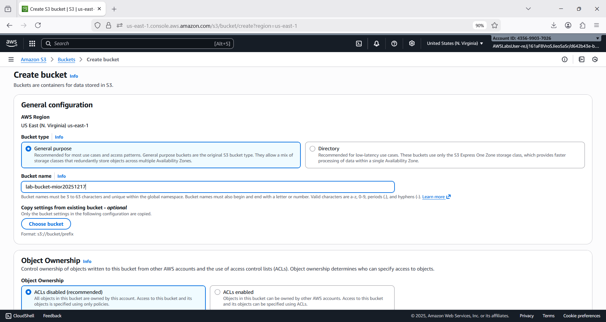
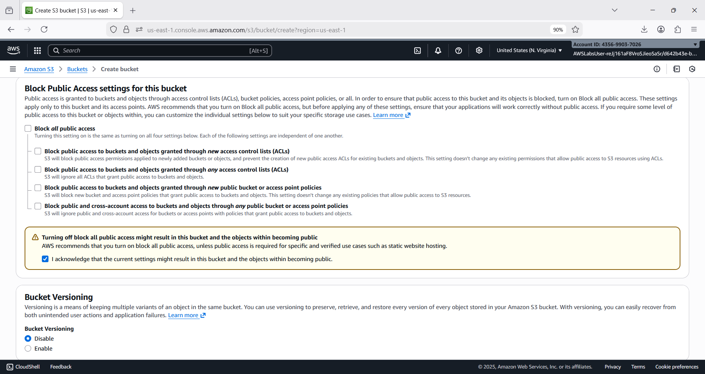
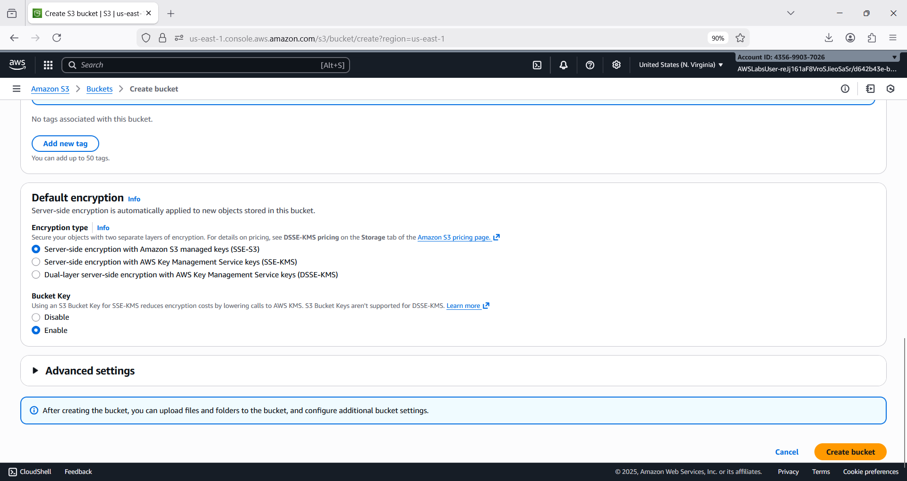
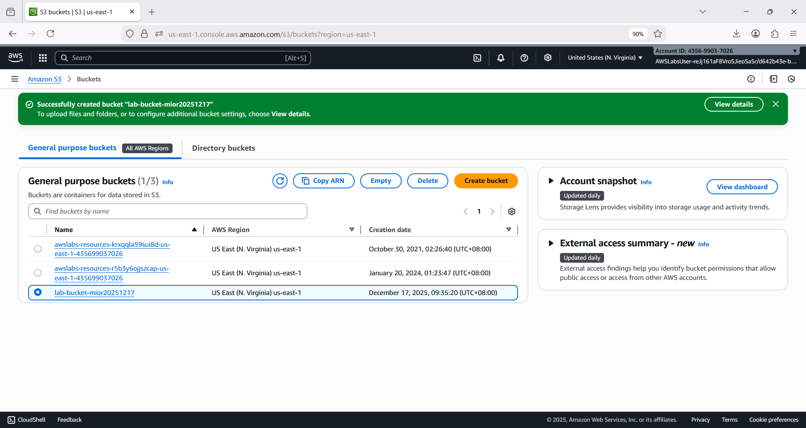
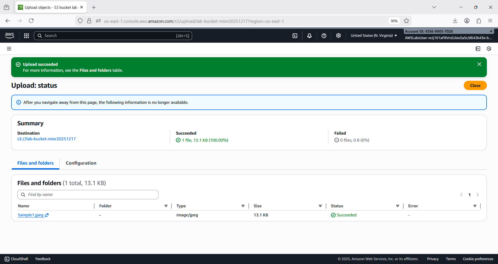
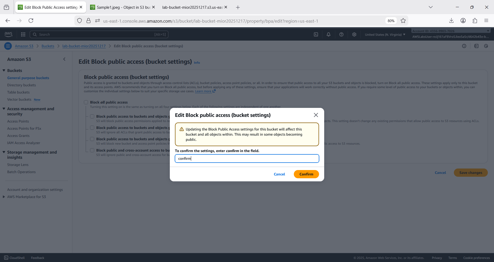
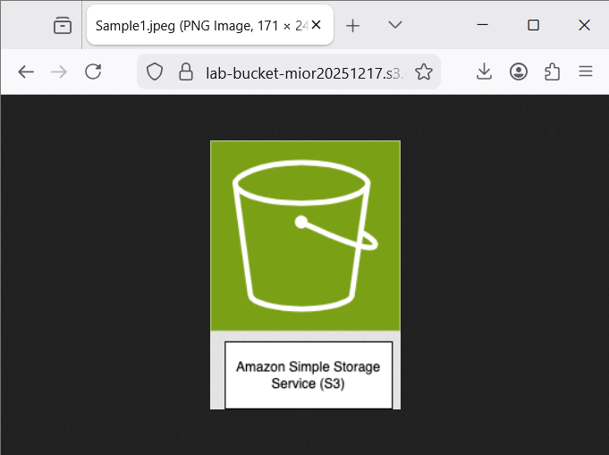
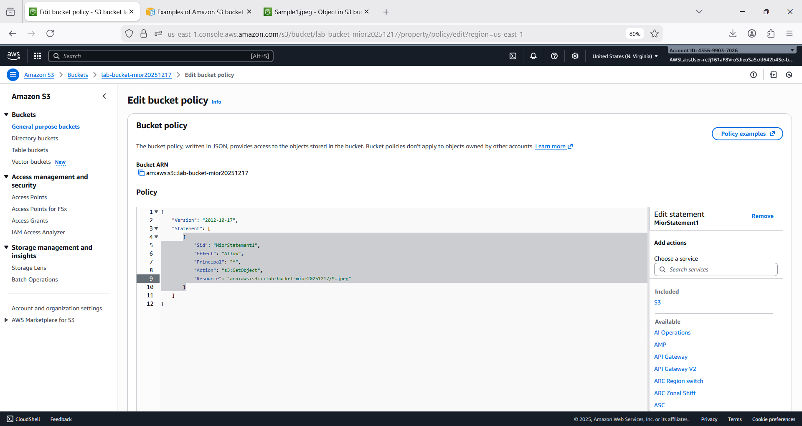
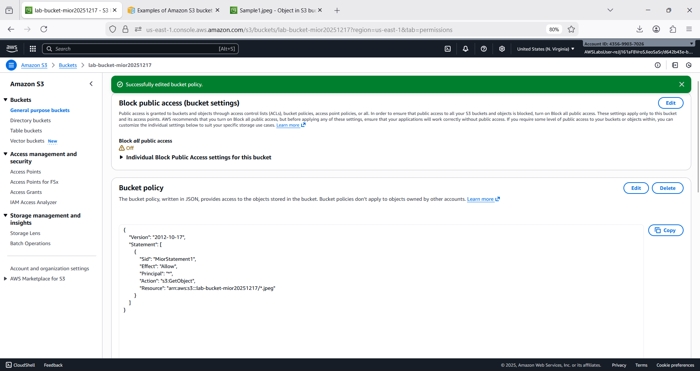
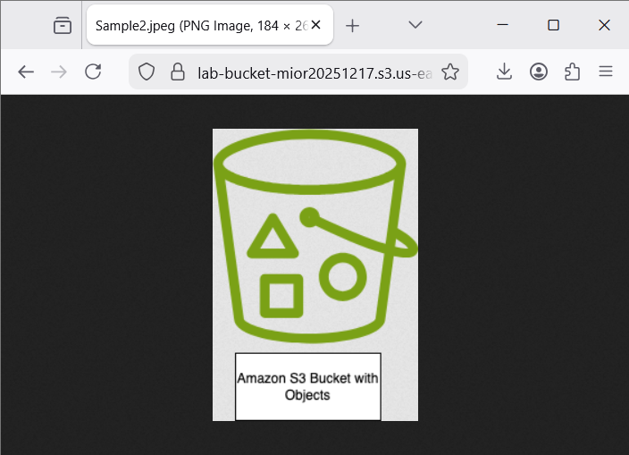

# clfc02d1 💾☁️🪣
clfc02d1 : Amazon S3 # Simple Storage Service # Bucket Policy # CLF-C02

## Objective
- Demonstrate how to create an S3 bucket and upload an object to it.
  - Creeate bucket in amazon S3
  - Upload object to bucket
- Demonstrate how to add a bucket policy to secure access to the bucket and the object in it.
  - Add bucket policy
  - Access object in bucket

## S3

